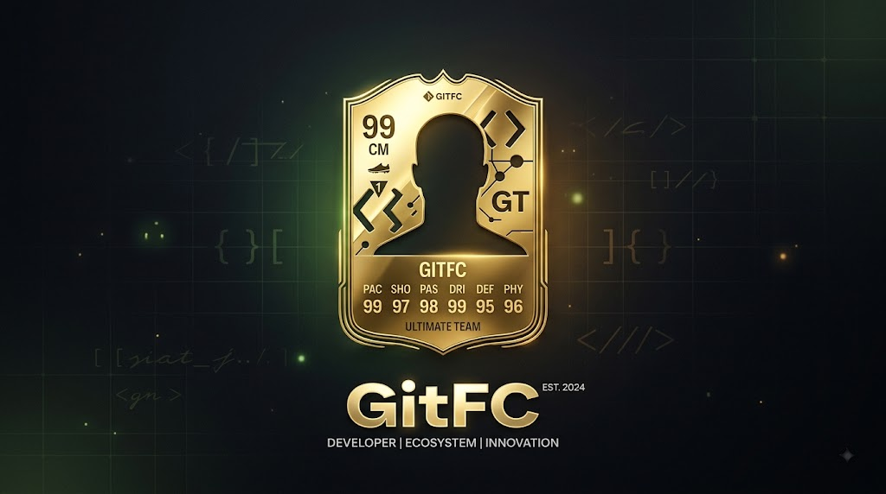

<div align="center">

  

  # ⚽ GitFC — Turn Your GitHub Into an EA FC Football Card

  **Transform your GitHub activity, commits, PRs, stars, and streaks into authentic EA FC Ultimate Team developer cards.**

  [](https://gitfc.vercel.app/)
  [](https://github.com/ShreyashSrivastavaa/GitFc)
  [](https://react.dev/)
  [](https://www.typescriptlang.org/)
  [](https://tailwindcss.com/)

  [🎮 Explore Live Demo](https://gitfc.vercel.app/) • [⭐ Star on GitHub](https://github.com/ShreyashSrivastavaa/GitFc) • [🐛 Report Bug](https://github.com/ShreyashSrivastavaa/GitFc/issues)

</div>

---

## 🌟 Overview

**GitFC** is an interactive, gamified sports analytics engine that transforms open-source GitHub statistics into authentic **EA FC 25 Ultimate Team Player Cards**. 

Whether you are a commit machine, a open-source stargazing maintainer, or a pull request wizard, **GitFC** evaluates your lifetime and seasonal GitHub activity, assigns custom positions (ST, CM, CB, GK), allocates card rarity tiers (TOTY, ICON, Scream, TOTY Icon), and ranks your performance across competitive **Dev Leagues**.

---

## ✨ Core Features

### 🎴 1. Algorithmic Rating Engine
* **Dynamic OVR Index (45 to 99)**: Automatically computes your overall rating using a weighted mathematical matrix based on career commits, pull requests, stars, active streaks, and language diversity.
* **Tactical Role Allocation**: Automatically assigns your football position:
  * **ST (Striker)**: High-impact stargazers & popular repository creators.
  * **CM / CAM (Midfielder)**: High-volume committers & core contributors.
  * **CB / RB (Defender)**: Active issue solvers & stability maintainers.
  * **GK (Goalkeeper)**: Dedicated repository maintainers.

### 💎 2. EA FC Card Shell Rarity Tiers
* 🏆 **TOTY / TOTY ICON (95+ OVR)**: GOAT tier for open-source legends (Linus Torvalds, Dan Abramov, etc.).
* 👑 **ICON / HEROES (88+ OVR)**: Pure marble & gold trim for top 5% developers.
* 🌙 **ULTIMATE SCREAM / WORLD TOUR**: Unlocked by 180+ day contribution streaks or 6+ tech stack languages.
* 🥇 **GOLD / SILVER / BRONZE**: Authentic EA FC 25 FUT card designs.

### 🏆 3. Competitive Dev Leagues & Divisions
* **Exclusive League System**: Compete across Tier 1, Tier 2, and Tier 3 leagues:
  * 🥇 **Tier 1 Elite**: *Premier DevLeague*, *La DevLeague*, *Serie DevLeague*, *Bundes DevLeague*.
  * 🇪🇺 **Continental**: *Champions League (Hard)*, *World Cup (Extreme)*.
* **Points Carry-Forward**: Switch leagues anytime without losing your hard-earned season points or match history!

### 🏟️ 4. Squad Builder & Dressing Room
* **15-Player Tactical Squad**: Assemble your dream developer XI with 4-3-3, 4-2-3-1, and 3-5-2 formations.
* **Team Chemistry & Formation Ratings**: Evaluates squad synergy, average OVR, and total team power score.

### 📤 5. 1-Click PNG Export & Social Sharing
* **High-Res PNG Export**: Render and download crystal-clear 2x retina EA FC cards.
* **WhatsApp, Twitter/X & LinkedIn Integration**: 1-click sharing that automatically downloads the PNG card image and copies formatted post links for social media.

---

## 📊 GitHub to EA FC Attribute Mapping

| GitHub Statistic | EA FC Attribute | Description |
| :--- | :--- | :--- |
| **Total Commits** | **PAS (Passing)** | Measures playmaking volume & contribution consistency |
| **Pull Requests Merged** | **SHO (Shooting)** | Evaluates direct code delivery & feature completions |
| **Stars Earned** | **DRI (Dribbling)** | Reflects code popularity, flair, and community recognition |
| **Active Contribution Streak** | **PAC (Pace)** | Measures daily momentum and development speed |
| **Issues Closed** | **DEF (Defense)** | Reflects bug fixing capability and codebase stability |
| **GitHub Followers** | **PHY (Physicality)** | Measures developer presence and ecosystem footprint |

---

## 🚀 Getting Started Locally

Follow these steps to run **GitFC** on your local machine:

### Prerequisites
* Node.js v18.0.0 or higher
* npm or pnpm package manager

### Installation

```bash
# 1. Clone the repository
git clone https://github.com/ShreyashSrivastavaa/GitFc.git

# 2. Navigate to project directory
cd GitFc

# 3. Install dependencies
npm install

# 4. Start local development server
npm run dev
```

The application will be available at `http://localhost:5173`.

---

## 🛠️ Tech Stack & Architecture

* **Frontend Framework**: [React 19](https://react.dev/) + [TypeScript](https://www.typescriptlang.org/)
* **Build Tool**: [Vite 8](https://vitejs.dev/)
* **Styling**: [Tailwind CSS 3.4](https://tailwindcss.com/) + Custom EA FC HSL Color System
* **Icons**: [Lucide React](https://lucide.dev/)
* **Card Rendering & Export**: `html-to-image` + Canvas API
* **Deployment**: [Vercel](https://vercel.com/)

---

## 🤝 Contributing

Contributions are always welcome! If you'd like to improve **GitFC**, add new card designs, or suggest feature ideas:

1. Fork the Project (`https://github.com/ShreyashSrivastavaa/GitFc/fork`)
2. Create your Feature Branch (`git checkout -b feature/AmazingFeature`)
3. Commit your Changes (`git commit -m 'Add some AmazingFeature'`)
4. Push to the Branch (`git push origin feature/AmazingFeature`)
5. Open a Pull Request

---

## 📄 License

Distributed under the **MIT License**. See `LICENSE` for more information.

---

<div align="center">

  **Created with ❤️ by [Shreyash Srivastava](https://github.com/ShreyashSrivastavaa)**

  [🌐 Live Site](https://gitfc.vercel.app/) • [⭐ Star Repo](https://github.com/ShreyashSrivastavaa/GitFc)

</div>
